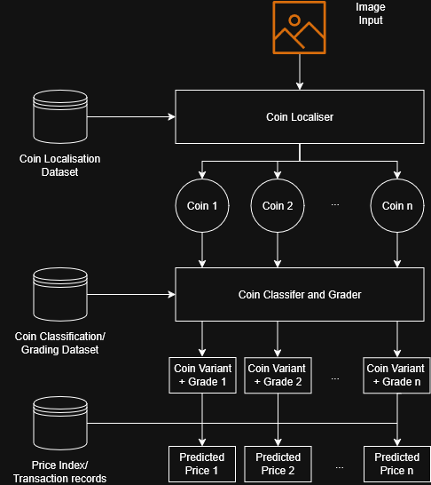

# AutoCoinNet

AutoCoinNet/AutoCoinScan is a web application for analysing coins from photographs. It detects individual coins, identifies them, estimates their condition, and provides reference and market price information.

The system combines computer vision models with numismatic catalogue and auction data to provide an accessible starting point for coin analysis.

**Demo:** [AutoCoinScan Web App](https://autocoinnet-web.coinrecognitionval.workers.dev)
> **Note:** The GPU backend was shut down on 28/09/2026 due to budget constraints.

## Approach

The system follows a three stage pipeline:

```text
Photo / Camera
      ↓
Coin Localisation
      ↓
Classification + Grading
      ↓
Catalogue + Market Valuation
```


## Detection

A YOLO26 segmentation model detects each coin in an image and returns its location, confidence and segmentation mask. The frontend uses these masks to isolate individual coins before classification.

## Classification

A multi task ConvNeXtV2 model identifies each coin using five prediction heads:
* Family
* Category
* Variety
* Face value
* Year

The variety prediction uses the hierarchy between family, category and variety to refine the raw model probabilities.

## Grade Estimation

A separate DINOv2 model with LoRA estimates the coin's condition on the Sheldon 70 point scale.

The grader combines:
* Gaussian grade regression
* Adjectival grade tier classification
* Circulated vs Mint State classification

These predictions are fused into a probability distribution across possible grades, allowing the application to show both an estimated grade and its uncertainty.

## Valuation

Valuation combines two sources:

**NGC catalogue data**

Reference coins and grade based price guides are used to provide a recommended catalogue price.

**Auction transactions**

Historical sales from multiple auction houses are matched to the identified coin and estimated grade. Recent comparable sales are used to produce a low, median and high market estimate.

Users can also correct the predicted identity, after which the catalogue and market estimates are updated.

## Frontend

The frontend is built with React 18 and Vite and provides:
* Camera and image upload
* Multi coin detection
* Interactive segmentation view
* Coin identification and confidence scores
* Grade probability distribution
* Catalogue comparison
* Historical transaction charts
* Editable coin identity
* Responsive desktop and mobile layouts

## Evaluation

The system was evaluated by 11 participants with different levels of numismatic experience.

Participants assessed usefulness, convenience, information provided, latency, confidence and accuracy.

The results indicated strong agreement that the system was useful, convenient, informative and responsive. Confidence and perceived accuracy were lower, suggesting that the system is better suited as a support tool and starting point for coin analysis rather than a replacement for professional appraisal.

Model weights and the coin/transaction dataset are not included in the repository.
